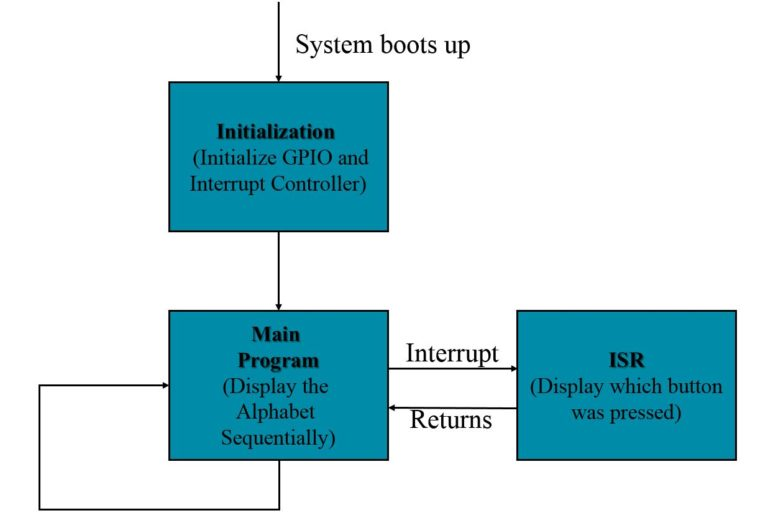

<h1>Interrupt Flow Chart</h1>
from:<br/>
- https://circuits4you.com/2017/12/08/esp8266-external-interrupt-example/ <br/>
- https://lastminuteengineers.com/handling-esp32-gpio-interrupts-tutorial/


An interrupt alerts the processor to a high-priority condition requiring the interruption of the current code the processor is executing. 
The processor responds by suspending its current activities, saving its state, and executing a function called an interrupt handler 
(or an interrupt service routine, ISR) to deal with the event.
 Each interrupt has a certain priority level and can be categorized into two types.

- Hardware Interrupts – These occur in response to an external event. For example, GPIO Interrupt(when a key is pressed down) or a 
Touch Interrupt(when touch is detected)

- Software Interrupts – These occur in response to a software instruction. For example, a Simple Timer Interrupt or Watchdog Timer 
Interrupt(when timer times out)

This interruption is temporary, and, after the interrupt handler finishes, the processor resumes normal activities.



External interrupts configuration requires three step process.

- Initialize IO pin as Input.
- Initialize IO with Interrupt Subroutine definition.
- Interrupt Subroutine.
The ESP8266 has two different kinds of interrupts: “external”, and “pin change”. ESP8266 all pins have external interrupt except GPIO 16.

## Step 1 & 2: Initialize IO pin as Input and Define interrupt

const int interruptPin = 0; //GPIO 0 (Flash Button)

inside setup function we configure this pin as input and attach a subroutine to this interrupt pin.
In Arduino IDE, we use a function called attachInterrupt() to set an interrupt on a pin by pin basis. 
The recommended syntax looks like below.

```c++
attachInterrupt(GPIOPin, ISR, Mode);
```

This function takes three parameters:

- GPIOPin – Sets the GPIO pin as an interrupt pin, which tells the ESP32 which pin to monitor.

- ISR – Is the name of the function that will be called every time the interrupt is triggered.

- Mode – Defines when the interrupt should be triggered. Five constants are predefined as valid values:


| Commands | Action                                                       |
| -------- | ------------------------------------------------------------ |
| HIGH     | Triggers interrupt whenever the pin is HIGH                  |
| LOW      | Triggers interrupt whenever the pin is LOW                   |
| CHANGE   | Triggers interrupt whenever the pin changes value, from HIGH to LOW or LOW to HIGH |
| FALLING  | Triggers interrupt when the pin goes from HIGH to LOW        |
| RISING   | Triggers interrupt when the pin goes from LOW to HIGH        |

```c++
pinMode(interruptPin, INPUT_PULLUP);
attachInterrupt(digitalPinToInterrupt(interruptPin), handleInterrupt, CHANGE);
```

In Arduino IDE, we use a function called attachInterrupt() to set an interrupt on a pin by pin basis. 
The recommended syntax looks like below.


## Step 3: Write a Subroutine for Interrupt Handler

```c++
void handleInterrupt() {
  Serial.println("Interrupt Detected");
}
```


